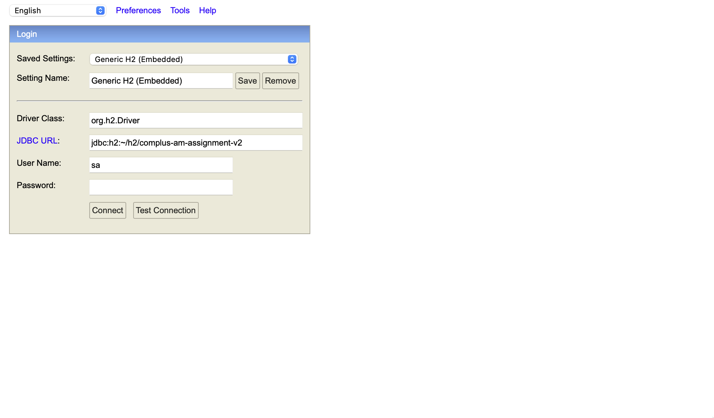
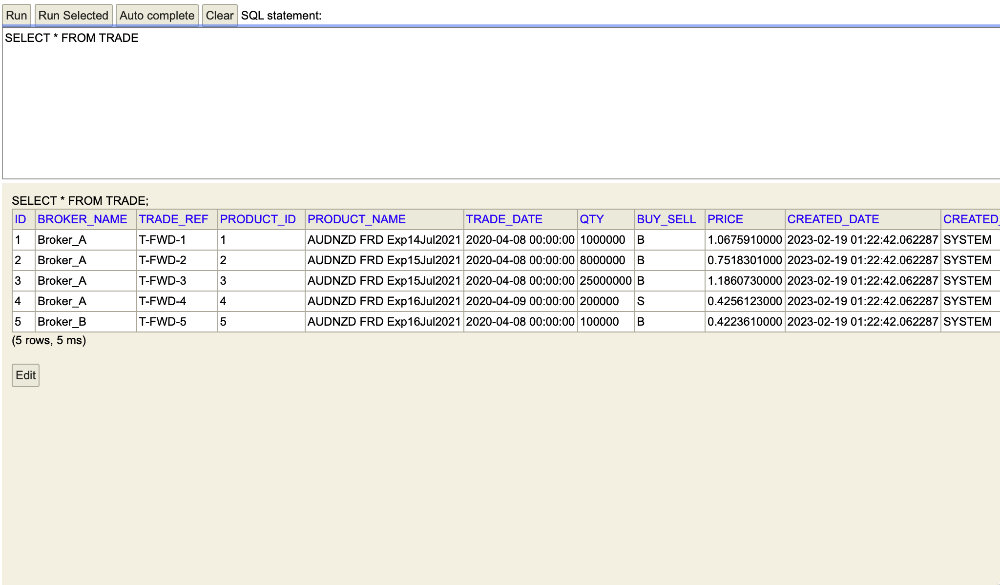

# Prerequisite

* IDE with lombok installed (eg: IDEA)
* JDK 17

# Build and run

## From IDEA

1. New project from existing sources
2. Run Gradle Tasks > application > bootRun

## From Terminal

Execute the following command:

```bash
./gradlew bootRun
```

# Generate sample response

Expected output:

```
tradeRef,productId,productName,tradeDate,qty,buySell,price
T-FWD-1,1,AUDNZD FRD Exp14Jul2021,20200408,1000000,B,1.067591
T-FWD-2,2,AUDNZD FRD Exp15Jul2021,20200408,8000000,B,0.7518301
T-FWD-3,3,AUDNZD FRD Exp15Jul2021,20200408,25000000,B,1.186073
```

## Terminal

Execute the following command:

```bash
curl -X 'GET' \
  'http://localhost:8080/api/v1/report/trade?reportType=fxForward&brokerName=Broker_A&tradeDate=2020-04-08' \
  -H 'accept: text/csv'
```

## Swagger UI

Navigate to [swagger-ui](http://localhost:8080/api/swagger-ui/index.html#/trade-report-controller/getCsvTradeReport)

Click `Try it now` with the following data entered:

```
reportType: fxForward
brokerName: Broker_A
tradeDate: 2020-04-08
```

Click `Execute`

# Miscellaneous

## H2 Console

To view the db records, navigate to [h2-console](http://localhost:8080/api/h2-console/)

Default h2 db file was located at `~/h2/complus-am-assignment-v2`



